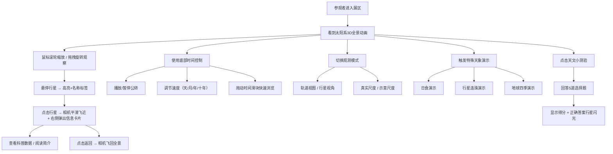

# 太阳系3D模拟天文科普互动平台 产品需求文档

## 1. 产品概述

科技馆太阳系3D模拟互动平台，通过沉浸式3D可视化让参观者直观了解太阳系八大行星的运行规律和天文知识。以可交互的3D场景为核心，结合时间控制、科普信息面板、特殊天象演示和知识问答等功能，打造寓教于乐的天文科普体验。

- 目标用户：科技馆参观者（全年龄段，以青少年学生为主）
- 核心价值：将抽象的天文知识转化为直观可交互的3D可视化体验
- 产品定位：科技馆常设展项，纯前端大屏互动应用

## 2. 核心功能

### 2.1 用户角色

| 角色 | 注册方式 | 核心权限 |
|------|----------|----------|
| 参观者 | 无需注册 | 浏览3D场景、交互操作、查看科普信息、参与问答 |

### 2.2 功能模块

1. **3D太阳系场景**：太阳、八大行星、月球、轨道线、星空背景
2. **行星数据展示**：每颗行星内置真实科普数据
3. **3D交互动效**：自由观察、悬停高亮、点击聚焦、相机平滑过渡
4. **时间控制系统**：播放/暂停、速度调节、时间滑块、模拟日期显示
5. **观测模式切换**：轨道视图/行星视角、真实尺度/示意尺度
6. **特殊天象演示**：日食、行星连珠、地球四季
7. **左侧信息面板**：当前天体信息、太阳系总览、距离标尺
8. **知识问答彩蛋**：天文小测验、答题计分、行星闪光庆祝

### 2.3 页面详情

| 页面名称 | 模块名称 | 功能描述 |
|----------|----------|----------|
| 主场景页 | 3D场景区 | 全屏3D太阳系渲染，支持鼠标/触摸交互 |
| 主场景页 | 左侧信息面板 | 当前聚焦天体名称、太阳系总览数据、距离标尺、模拟日期速度 |
| 主场景页 | 底部时间控制栏 | 播放/暂停按钮、速度档位、时间滑块、当前日期显示 |
| 主场景页 | 右侧行星卡片 | 点击行星后弹出科普数据表、简介、示意图 |
| 主场景页 | 观测模式按钮 | 轨道视图/行星视角切换、真实尺度/示意尺度切换 |
| 主场景页 | 特殊天象按钮 | 日食、行星连珠、地球四季演示触发 |
| 主场景页 | 天文小测验 | 右下角按钮弹出5道选择题，答题计分，行星闪光庆祝 |

## 3. 核心流程

## 4. 用户界面设计

### 4.1 设计风格

- **主色调**：深空蓝（#0a0e27）为背景主色，搭配星点白和金色强调色
- **辅助色**：行星本色（水星灰、金星黄、地球蓝、火星红、木星橙、土星黄、天王星青、海王星蓝）
- **按钮风格**：半透明玻璃拟态（glassmorphism），圆角12px，hover时轻微发光
- **字体**：标题使用现代科技感字体，正文使用清晰易读的无衬线字体
- **布局风格**：3D场景全屏居中，信息面板悬浮于左右两侧，时间控制栏悬浮底部
- **视觉元素**：星点背景、光晕效果、科技感边框线条

### 4.2 页面设计概览

| 页面名称 | 模块名称 | UI元素 |
|----------|----------|--------|
| 主场景页 | 3D场景 | 中心太阳发光，八大行星沿轨道运动，星空粒子背景，柔和光照 |
| 主场景页 | 左侧面板 | 半透明深色卡片，标题金色，数据白色，垂直排列 |
| 主场景页 | 底部控制栏 | 横向半透明条，播放按钮居中，速度按钮组，滑块轨道 |
| 主场景页 | 右侧卡片 | 滑入动画，行星图片占位，数据表格，简介文字 |
| 主场景页 | 问答弹窗 | 居中模态框，题目卡片，选项按钮，进度指示，得分展示 |

### 4.3 响应性

- Desktop-first 设计，面向科技馆大屏（1920×1080及以上）
- 支持平板触摸操作
- 信息面板和控制栏在小屏幕自动调整尺寸

### 4.4 3D场景指导

- **环境氛围**：深邃宇宙背景，数千颗星星粒子，柔和的环境光
- **光照设置**：太阳作为点光源发光，配合弱环境光，行星呈现明暗面
- **相机设置**：默认俯视轨道视角，支持OrbitControls自由旋转缩放
- **构图焦点**：太阳居中，行星轨道分布有层次，近大远小
- **交互动画**：相机移动使用Tween平滑过渡，悬停行星有放大/发光反馈
- **后处理效果**：Bloom辉光效果（太阳发光），轻微抗锯齿
- **性能预算**：60fps，粒子数控制在3000-5000，几何体面数适中

## 5. 行星数据规范

每颗行星包含以下数据字段：

| 字段 | 说明 | 单位 |
|------|------|------|
| name | 行星名称 | - |
| diameter | 直径 | km |
| mass | 质量 | kg |
| distance | 距太阳平均距离 | AU |
| orbitalPeriod | 公转周期 | 地球日 |
| rotationPeriod | 自转周期 | 地球日 |
| temperature | 表面温度 | °C |
| moons | 卫星数量 | 个 |
| composition | 组成成分 | - |
| description | 简介文字 | - |
| color | 显示颜色 | hex |
| sizeScale | 示意尺度大小 | 相对值 |
| realSizeScale | 真实尺度大小 | 相对值 |
| orbitRadius | 轨道半径 | 相对值 |
| orbitSpeed | 公转速度 | 相对值 |
| rotationSpeed | 自转速度 | 相对值 |
