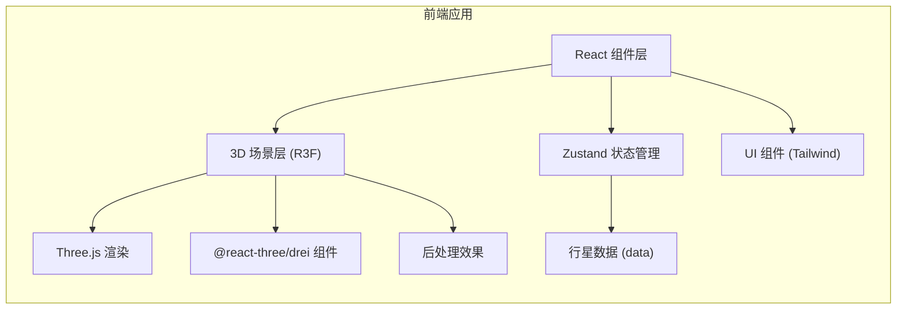

# 太阳系3D模拟天文科普互动平台 技术架构文档

## 1. 架构设计



## 2. 技术选型说明

| 技术 | 版本 | 用途 |
|------|------|------|
| React | ^18 | UI 框架 |
| TypeScript | ^5 | 类型安全 |
| Vite | ^5 | 构建工具 |
| Three.js | ^0.160 | 3D 渲染引擎 |
| @react-three/fiber | ^8 | React Three.js 渲染器 |
| @react-three/drei | ^9 | Three.js 常用组件库 |
| @react-three/postprocessing | ^2 | 后处理效果 (Bloom 等) |
| @tweenjs/tween.js | ^23 | 相机平滑动画 |
| zustand | ^4 | 状态管理 |
| tailwindcss | ^3 | CSS 框架 |
| lucide-react | ^0.300 | 图标库 |

## 3. 目录结构

```
src/
├── components/
│   ├── SolarSystem/          # 3D太阳系场景组件
│   │   ├── Sun.tsx           # 太阳组件
│   │   ├── Planet.tsx        # 行星组件（可复用）
│   │   ├── OrbitLine.tsx     # 轨道线组件
│   │   ├── StarField.tsx     # 星空背景
│   │   ├── Moon.tsx          # 月球组件
│   │   ├── SaturnRing.tsx    # 土星光环
│   │   └── index.tsx         # 太阳系主组件
│   ├── UI/
│   │   ├── LeftPanel.tsx     # 左侧信息面板
│   │   ├── BottomControls.tsx # 底部时间控制栏
│   │   ├── RightCard.tsx     # 右侧行星信息卡
│   │   ├── ViewModeButtons.tsx # 观测模式按钮
│   │   ├── DemoButtons.tsx   # 特殊天象按钮
│   │   └── QuizModal.tsx     # 问答弹窗
│   └── common/               # 通用组件
├── hooks/
│   ├── useTimeControl.ts     # 时间控制 hook
│   ├── useCameraAnimation.ts # 相机动画 hook
│   └── useHoverDetection.ts  # 悬停检测 hook
├── store/
│   └── useSolarStore.ts      # Zustand 全局状态
├── data/
│   ├── planets.ts            # 行星数据
│   ├── quizQuestions.ts      # 问答题目数据
│   └── constants.ts          # 常量配置
├── types/
│   └── index.ts              # TypeScript 类型定义
├── utils/
│   ├── astronomy.ts          # 天文计算工具
│   └── tween.ts              # 动画工具函数
├── App.tsx                   # 应用入口组件
├── main.tsx                  # React 入口
└── index.css                 # 全局样式
```

## 4. 状态管理设计

### Zustand Store 状态定义

```typescript
interface SolarState {
  // 时间控制
  simulationTime: number;      // 模拟时间（天）
  timeSpeed: number;           // 时间速度倍率
  isPlaying: boolean;          // 是否播放中
  speedPreset: 'day' | 'month' | 'year' | 'decade';
  
  // 相机/视角
  focusedPlanet: string | null;  // 当前聚焦的行星
  viewMode: 'orbit' | 'planet';  // 观测模式
  scaleMode: 'real' | '示意';     // 尺度模式
  
  // UI 状态
  showRightCard: boolean;
  showQuizModal: boolean;
  hoveredPlanet: string | null;
  
  // 问答状态
  quizScore: number;
  quizCurrentIndex: number;
  quizAnswered: boolean[];
  correctPlanets: string[];
  
  // Actions
  setTimeSpeed: (speed: number) => void;
  togglePlay: () => void;
  setSpeedPreset: (preset: 'day' | 'month' | 'year' | 'decade') => void;
  setSimulationTime: (time: number) => void;
  focusPlanet: (name: string | null) => void;
  setViewMode: (mode: 'orbit' | 'planet') => void;
  setScaleMode: (mode: 'real' | '示意') => void;
  setHoveredPlanet: (name: string | null) => void;
  toggleQuizModal: () => void;
  answerQuestion: (questionIndex: number, isCorrect: boolean, planetName: string) => void;
  resetQuiz: () => void;
  triggerDemo: (demo: 'eclipse' | 'alignment' | 'seasons') => void;
}
```

## 5. 核心组件说明

### 5.1 太阳系主组件 (SolarSystem)

- 负责 Three.js 场景初始化
- 管理所有行星、轨道、星空
- 集成 OrbitControls
- 处理帧更新循环，驱动行星公转和自转
- 监听时间状态，计算行星位置

### 5.2 行星组件 (Planet)

- 接收行星数据，渲染球体
- 支持自发光材质、纹理贴图
- 处理悬停高亮效果
- 点击事件：触发相机聚焦和信息卡片
- 根据尺度模式切换大小

### 5.3 时间控制 Hook (useTimeControl)

- 使用 requestAnimationFrame 驱动时间流逝
- 根据 speedPreset 计算速度倍率
- 计算当前模拟日期
- 支持暂停/播放/跳转

### 5.4 相机动画 Hook (useCameraAnimation)

- 使用 @tweenjs/tween.js 实现平滑过渡
- 聚焦行星时计算相机目标位置
- 返回全景视角时重置相机
- 支持行星视角模式（跟随行星）

## 6. 数据模型

### 6.1 行星数据模型

```typescript
interface PlanetData {
  id: string;
  name: string;
  nameEn: string;
  
  // 真实天文数据
  diameter: number;       // km
  mass: string;           // kg (科学计数法字符串)
  distanceAU: number;     // 天文单位
  distanceKM: number;     // km
  orbitalPeriod: number;  // 天
  rotationPeriod: number; // 天
  temperature: { min: number; max: number; average: number };
  moons: number;
  composition: string;
  description: string;
  
  // 可视化参数
  color: string;
  emissiveColor?: string;
  showRing?: boolean;
  ringColor?: string;
  hasMoon?: boolean;
  
  // 3D 场景参数 (示意尺度)
  visualSize: number;
  orbitRadius: number;
  orbitSpeed: number;    // 相对速度因子
  rotationSpeed: number;
  
  // 真实尺度参数
  realSize: number;
  realOrbitRadius: number;
  
  // 初始角度
  initialAngle: number;
}
```

### 6.2 问答题目模型

```typescript
interface QuizQuestion {
  id: number;
  question: string;
  options: string[];
  correctIndex: number;
  relatedPlanet: string;  // 答对时闪光的行星
  explanation: string;
}
```

## 7. 性能优化方案

1. **InstancedMesh**：星空粒子使用实例化网格
2. **LOD (Level of Detail)**：远距离行星使用低多边形模型
3. **像素比限制**：限制渲染像素比，避免高分屏性能问题
4. **按需渲染**：暂停时减少渲染频率
5. **几何体复用**：相同大小行星复用球体几何体
6. **材质合并**：尽量减少材质数量

## 8. 初始化脚本

使用 Vite react-ts 模板初始化项目，然后添加 Three.js 相关依赖和 Tailwind CSS 配置。
